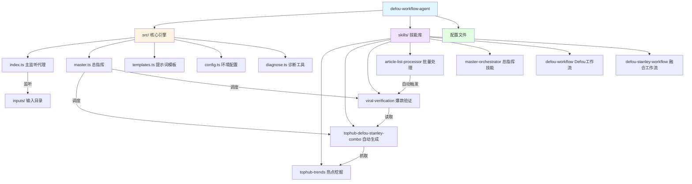

# Defou Workflow Agent - AI 上下文文档

> **生成时间**: 2025-01-15
> **项目类型**: TypeScript/Node.js 工作流自动化代理
> **主要功能**: 基于 Defou x Stanley 方法论的智能内容创作工作流

---

## 项目概览

**Defou Workflow Agent** 是一个智能化的内容创作自动化系统，结合了深度结构化思考（Defou风格）与人性弱点洞察（Stanley风格），实现从"灵感获取"到"内容重塑"再到"爆款验证"的全流程自动化。

### 核心价值主张

- **智能路由**: 自动匹配最适合的传播模板（热点/反鸡汤/吐槽/干货）
- **三重视角重塑**: 极致爆款版、深度认知版、终极融合版三种输出
- **全自动工作流**: 热点发现 → 选题筛选 → 内容生成 → 质量验证
- **文件监听机制**: 实时处理输入文件，零人工干预

### 技术栈

| 类别 | 技术 |
|------|------|
| 运行时 | Node.js (v16+) |
| 语言 | TypeScript 5.7 |
| AI模型 | OpenAI 兼容 API (默认 gpt-4o-mini) |
| 网页抓取 | Cheerio, JSDOM, @mozilla/readability |
| 文件监听 | Chokidar |
| 并发控制 | p-limit |

---

## 模块架构图



---

## 模块索引

### 核心模块 (src/)

| 模块 | 文件 | 功能 | 入口点 |
|------|------|------|--------|
| 主监听代理 | `index.ts` | 文件监听与自动处理 | `npm start` |
| 总指挥 | `master.ts` | 串联全流程调度 | `npm run skill:master` |
| 提示词模板 | `templates.ts` | Defou x Stanley 提示词 | 被引入 |
| 环境配置 | `config.ts` | 环境变量与路径 | 被引入 |
| 诊断工具 | `diagnose.ts` | API 连接诊断 | 独立运行 |

### 技能模块 (skills/)

| 技能 | 目录 | 核心功能 | 触发方式 |
|------|------|----------|----------|
| 热点挖掘 | `tophub-trends/` | 抓取并分析 TopHub 热榜 | `npm run skill:tophub` |
| 自动生成 | `tophub-defou-stanley-combo/` | 热点→选题→生成全流程 | `npm run skill:combo` |
| 爆款验证 | `viral-verification/` | 内容评分与优化建议 | `npm run skill:verify` |
| 批量处理 | `article-list-processor/` | 文章链接批量抓取生成 | `npm run skill:list` |
| 总指挥 | `master-orchestrator/` | 串联生成与验证 | 被 master.ts 调用 |
| Defou工作流 | `defou-workflow/` | Defou 风格提示词定义 | 被引入 |
| 融合工作流 | `defou-stanley-workflow/` | Defou x Stanley 融合提示词 | 被引入 |

---

## 全局标准与规范

### 代码风格

- **语言**: 所有输出内容必须使用简体中文
- **异步处理**: 使用 `async/await` 处理异步操作
- **并发控制**: 使用 `p-limit` 限制并发请求数（默认为 2）
- **错误处理**: 使用 try-catch 包裹可能失败的操作
- **文件路径**: 使用 `path.resolve()` 和 `path.join()` 处理跨平台路径

### 提示词工程

Defou x Stanley 方法论的核心提示词定义在 `src/templates.ts` 中，包含：

1. **智能路由**: T1-T4 四种内容模板匹配
2. **三版本生成**:
   - 版本 A (Stanley Style): 极致爆款、情绪共鸣
   - 版本 B (Defou Style): 深度认知、底层逻辑
   - 版本 C (Combo Style): 传播力与深度结合
3. **评分系统**: 好奇心、共鸣度、清晰度、转发价值

### 数据流规范

```
输入阶段
  ↓
处理阶段 (processing/)
  ↓
输出阶段 (outputs/)
  ↓
归档阶段 (archive/)
错误阶段 (errors/)
```

### 环境配置

项目依赖 `.env` 文件配置以下变量：

```env
# OpenAI 配置
OPENAI_API_KEY=sk-your-openai-key-here
OPENAI_BASE_URL=https://api.openai.com/v1
OPENAI_MODEL=gpt-4o-mini

# 技能级别模型配置（可选）
OPENAI_MODEL_COMBO=gpt-4o
OPENAI_MODEL_VERIFY=gpt-4o-mini
OPENAI_MODEL_LIST=gpt-4o-mini

# Mock 模式（用于测试）
MOCK_MODE=false
```

---

## 关键数据模型

### HotItem (热点条目)
```typescript
interface HotItem {
  rank: string;      // 排名
  title: string;     // 标题
  link: string;      // 链接
  hot: string;       // 热度值
  source: string;    // 来源平台
}
```

### Topic (选题)
```typescript
interface Topic {
  title: string;     // 标题
  reason: string;    // 选择理由
  source: string;    // 来源
  link: string;      // 原始链接
}
```

### ArticleItem (文章条目)
```typescript
interface ArticleItem {
  title: string;     // 标题
  link: string;      // 链接
}
```

---

## 工作流详解

### 1. 主监听代理工作流 (npm start)

```
启动 → 监听 inputs/ 目录
  ↓
检测到 .md/.txt/.json 文件
  ↓
移动到 processing/
  ↓
调用 OpenAI API 生成内容
  ↓
保存到 outputs/articles/
  ↓
移动原文件到 archive/
  ↓
出错时移动到 errors/
```

### 2. 总指挥工作流 (npm run skill:master)

```
启动
  ↓
执行 skill:combo (热点抓取→选题→生成)
  ↓
执行 skill:verify (内容验证与优化)
  ↓
完成并输出到 outputs/viral-verified-posts/
```

### 3. 批量处理工作流 (npm run skill:list)

```
启动监听 local_inputs/
  ↓
检测到包含链接的 Markdown 文件
  ↓
解析 [标题](链接) 格式
  ↓
并发抓取文章内容 (Readability)
  ↓
生成 Defou x Stanley 风格内容
  ↓
自动触发 skill:verify
  ↓
归档输入文件
```

---

## 依赖关系图

```mermaid
graph LR
    OpenAI[openai] --> Index[index.ts]
    OpenAI --> Tophub[tophub.ts]
    OpenAI --> Combo[index.ts]
    OpenAI --> Verify[index.ts]
    OpenAI --> List[index.ts]

    Chokidar[chokidar] --> Index
    Chokidar --> List

    Cheerio[cheerio] --> Tophub
    Cheerio --> Combo

    Readability[@mozilla/readability] --> List
    JSDOM[jsdom] --> List

    PLimit[p-limit] --> Index
    PLimit --> Combo
    PLimit --> Verify
    PLimit --> List

    Fetch[node-fetch] --> Tophub
    Fetch --> Combo
    Fetch --> List
```

---

## 质量工具与测试

**注意**: 项目当前没有配置自动化测试框架。

### 手动测试方式

1. **Mock 模式**: 设置 `MOCK_MODE=true` 可在不消耗 Token 的情况下测试流程
2. **诊断工具**: 运行 `ts-node src/diagnose.ts` 测试 API 连接

### 推荐添加的测试

- [ ] 单元测试框架 (Jest/Vitest)
- [ ] API Mock 工具 (MSW)
- [ ] 文件系统 Mock (memfs)
- [ ] E2E 测试 (Playwright)

---

## 已知限制与注意事项

1. **无自动化测试**: 依赖手动测试和 Mock 模式
2. **错误处理**: 部分网络错误可能导致整个流程中断
3. **并发限制**: 固定为 2，未配置化
4. **硬编码路径**: 部分路径硬编码在技能文件中
5. **无日志系统**: 仅使用 console.log，缺乏结构化日志
6. **无性能监控**: 缺少执行时间、Token 消耗等指标收集

---

## 未来迭代方向

详见 `PROJECT_OPTIMIZATION.md`，主要包括：

1. **数据源拓展**: 引入更多垂直领域榜单（Hacker News, Product Hunt, 抖音热搜等）
2. **风格提炼**: 创建风格逆向工程系统，支持自定义博主风格
3. **案例库迭代**: 建立动态案例库和金句仓库
4. **模板进化**: 开发 T5-T7 等更高维度的内容模板
5. **自动化闭环**: A/B 测试自动化、评分系统升级

---

## 快速命令参考

```bash
# 开发环境启动
npm start              # 启动文件监听代理

# 技能执行
npm run skill:tophub   # 热点挖掘
npm run skill:combo    # 全自动生成
npm run skill:verify   # 爆款验证
npm run skill:list     # 批量处理
npm run skill:master   # 一键全流程

# 构建
npm run build          # TypeScript 编译
```

---

## 导航至子模块

- [src/ 模块文档](./src/CLAUDE.md)
- [skills/ 模块文档](./skills/CLAUDE.md)

---

**文档维护**: 此文档应与代码同步更新，确保 AI 助手始终拥有准确的上下文信息。
