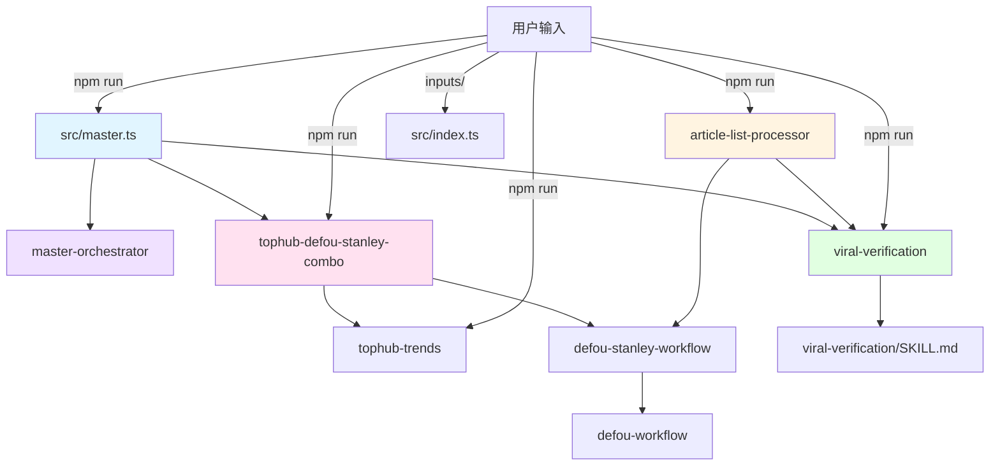

# skills/ 技能模块文档

> **父级**: [根目录 CLAUDE.md](../CLAUDE.md)
> **模块类型**: 独立技能脚本集合
> **主要功能**: 热点挖掘、内容生成、质量验证、批量处理

---

## 模块概览

`skills/` 目录包含 7 个独立技能模块，每个技能都是可独立运行的 TypeScript 脚本，实现特定的内容创作或处理功能。

### 技能清单

| 技能目录 | 主要文件 | 功能描述 | 触发命令 | 依赖外部 API |
|----------|----------|----------|----------|--------------|
| `tophub-trends/` | `tophub.ts` | 热榜抓取与分析 | `npm run skill:tophub` | TopHub, OpenAI |
| `tophub-defou-stanley-combo/` | `index.ts` | 热点→生成全流程 | `npm run skill:combo` | TopHub, OpenAI |
| `viral-verification/` | `index.ts` | 内容验证与优化 | `npm run skill:verify` | OpenAI |
| `article-list-processor/` | `index.ts` | 批量链接处理 | `npm run skill:list` | OpenAI, Readability |
| `master-orchestrator/` | - | 总指挥技能文档 | 被 master.ts 调用 | - |
| `defou-workflow/` | - | Defou 风格提示词 | 被引入 | - |
| `defou-stanley-workflow/` | - | 融合风格提示词 | 被引入 | - |

---

## 技能详细说明

### 1. tophub-trends - 热点挖掘技能

**目录结构**:
```
tophub-trends/
├── tophub.ts          # 主脚本
└── SKILL.md           # 技能文档
```

**功能**: 抓取 TopHub 热榜并分析流量潜力

**核心流程**:
```typescript
run()
  → fetchHotList()           // 抓取 TopHub 数据
  → 保存原始数据 (JSON)
  → analyzeHotList()         // OpenAI 分析
  → 保存分析报告 (Markdown)
```

**数据模型**:
```typescript
interface HotItem {
  rank: string;      // 排名
  title: string;     // 标题
  link: string;      // 链接
  hot: string;       // 热度值
  source: string;    // 来源平台
}
```

**输出位置**: `outputs/trends/tophub_analysis_*.md`

**关键技术**:
- `cheerio`: HTML 解析
- `node-fetch`: HTTP 请求
- OpenAI AI: 热点分析与建议

---

### 2. tophub-defou-stanley-combo - 自动生成技能

**目录结构**:
```
tophub-defou-stanley-combo/
├── index.ts           # 主脚本
└── SKILL.md           # 技能文档
```

**功能**: 热点→选题→生成的全自动流程

**核心流程**:
```typescript
run()
  → fetchHotList()           // 1. 抓取热榜
  → selectBestTopics()       // 2. AI 筛选 Top 10
  → generateContent() × 10   // 3. 并发生成内容
  → 保存到 defou-stanley-posts/
```

**数据模型**:
```typescript
interface Topic {
  title: string;     // 标题
  reason: string;    // 选择理由
  source: string;    // 来源
  link: string;      // 原始链接
}
```

**输出位置**: `outputs/defou-stanley-posts/post_*.md`

**并发控制**: 使用 `p-limit(2)` 限制并发为 2

**内容结构**:
- 路由与策略
- 版本 A: Stanley Style (极致爆款)
- 版本 B: Defou Style (深度认知)
- 版本 C: Combo Style (终极融合)
- 发布建议

---

### 3. viral-verification - 爆款验证技能

**目录结构**:
```
viral-verification/
├── index.ts           # 主脚本
└── SKILL.md           # 验证标准与 Prompt
```

**功能**: 对已生成内容进行爆款要素评分与优化

**核心流程**:
```typescript
run()
  → getPendingFiles()         // 获取待验证文件
  → verifyContent() × N       // 并发验证
  → 保存到 viral-verified-posts/
```

**验证标准** (来自 SKILL.md):
1. **好奇心** (Curiosity): 是否引发好奇
2. **情绪** (Emotion): 情绪共鸣强度
3. **价值** (Value): 实用价值含量
4. **时效** (Timeliness): 时效性与紧迫感
5. **节奏** (Rhythm): 阅读节奏与流畅度
6. **新颖性** (Novelty): 角度或观点的新鲜度

**输出位置**: `outputs/viral-verified-posts/verified_*.md`

**去重机制**: 通过文件名检测避免重复验证

---

### 4. article-list-processor - 批量处理技能

**目录结构**:
```
article-list-processor/
├── index.ts           # 主脚本
└── SKILL.md           # 技能文档
```

**功能**: 批量抓取文章链接并生成内容

**核心流程**:
```typescript
run()  [监听模式]
  → chokidar.watch('local_inputs/')
  → 检测到 Markdown 文件
  → parseMarkdownLinks()     // 解析 [标题](链接)
  → fetchArticleContent() × N // 并发抓取
  → generateContent() × N    // 并发生成
  → runVerifySkill()         // 自动触发验证
  → 归档输入文件
```

**数据模型**:
```typescript
interface ArticleItem {
  title: string;     // 标题
  link: string;      // 链接
}
```

**输出位置**: `outputs/defou-stanley-posts/list_*.md`

**关键技术**:
- `@mozilla/readability`: 提取文章正文
- `jsdom`: DOM 解析
- 正则表达式解析 Markdown 链接

---

### 5. master-orchestrator - 总指挥技能

**目录结构**:
```
master-orchestrator/
└── SKILL.md           # 文档说明
```

**功能**: 定义总指挥的工作流程和规范

**编排流程**:
1. 执行 `skill:combo` (内容生成引擎)
2. 执行 `skill:verify` (质量验证引擎)
3. 输出最终成品

**实现位置**: `src/master.ts`

---

### 6. defou-workflow - Defou 风格定义

**目录结构**:
```
defou-workflow/
└── SKILL.md           # Defou 风格提示词
```

**功能**: 定义 Defou 内容创作方法论

**核心特点**:
- 冷静、克制、不讨好
- 判断先于情绪
- 结构 > 努力
- 选择 > 执行
- 长期主义 > 短期刺激

---

### 7. defou-stanley-workflow - 融合风格定义

**目录结构**:
```
defou-stanley-workflow/
└── SKILL.md           # 融合风格提示词
```

**功能**: 定义 Defou x Stanley 融合方法论

**核心特点**:
- 深度结构化思考
- 人性弱点洞察
- 智能路由 (T1-T4)
- 三版本生成体系

---

## 技能依赖关系图



---

## 通用模式与规范

### 技能脚本结构

所有可执行技能脚本遵循以下模式：

```typescript
// 1. 环境配置
const projectRoot = path.resolve(__dirname, '../../');
dotenv.config({ path: path.join(projectRoot, '.env') });

// 2. OpenAI 客户端初始化
const openai = new OpenAI({
  apiKey: process.env.OPENAI_API_KEY || 'dummy',
  baseURL: process.env.OPENAI_BASE_URL,
});

// 3. 核心函数
async function main() { /* ... */ }

// 4. 可独立运行
if (require.main === module) {
  main();
}
```

### 输出文件命名规范

| 技能 | 输出文件格式 | 示例 |
|------|--------------|------|
| tophub-trends | `tophub_analysis_{timestamp}.md` | `tophub_analysis_2025-01-15T10-30-00.md` |
| combo | `post_{timestamp}_{sanitized_title}.md` | `post_2025-01-15T10-30-00_Some_Title.md` |
| verify | `verified_{timestamp}_{original_name}.md` | `verified_2025-01-15T10-30-00_post_xxx.md` |
| list | `list_{timestamp}_{sanitized_title}.md` | `list_2025-01-15T10-30-00_Article_Title.md` |

### 并发控制标准

所有需要并发的技能都使用 `p-limit`:

```typescript
import pLimit from 'p-limit';
const limit = pLimit(2);  // 限制为 2

const tasks = items.map(item => limit(() => processItem(item)));
await Promise.all(tasks);
```

---

## 测试与调试

### 独立运行技能

```bash
# 热点挖掘
npm run skill:tophub

# 自动生成
npm run skill:combo

# 验证特定文件
npm run skill:verify -- outputs/defou-stanley-posts/post_xxx.md

# 批量处理（监听模式）
npm run skill:list
```

### Mock 模式测试

在 `.env` 中设置 `MOCK_MODE=true`，所有技能将返回模拟数据。

---

## 常见问题

### 1. 技能执行失败
- 检查 `.env` 文件是否存在
- 确认 `OPENAI_API_KEY` 已配置
- 查看控制台错误信息

### 2. 输出目录不存在
技能脚本会自动创建必要的输出目录，无需手动创建。

### 3. 并发 Rate Limit
如遇到 API 限流，调整 `p-limit` 的值（默认为 2）。

---

## 扩展新技能指南

创建新技能的步骤：

1. **创建目录**: `skills/your-skill/`
2. **编写脚本**: 创建 `index.ts`
3. **添加文档**: 创建 `SKILL.md`
4. **注册命令**: 在根 `package.json` 添加 npm 脚本
5. **测试**: 使用 Mock 模式验证逻辑

**模板**:
```typescript
import fs from 'fs';
import path from 'path';
import dotenv from 'dotenv';

const projectRoot = path.resolve(__dirname, '../../');
dotenv.config({ path: path.join(projectRoot, '.env') });

async function main() {
  // 你的逻辑
}

if (require.main === module) {
  main();
}
```

---

## 未来迭代方向

### 计划中的技能

1. **style-extractor**: 从博主演示中提取风格特征
2. **ab-tester**: 自动生成 A/B 测试变体
3. **publisher**: 自动发布到社交媒体平台
4. **analytics**: 内容表现数据分析

### 技能优化

- [ ] 统一错误处理机制
- [ ] 添加进度条显示
- [ ] 支持配置文件覆盖默认参数
- [ ] 实现技能间数据传递优化

---

**导航**: [返回根目录](../CLAUDE.md) | [查看 src/ 模块](../src/CLAUDE.md)
