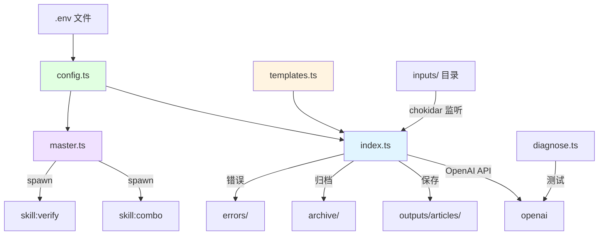

# src/ 核心模块文档

> **父级**: [根目录 CLAUDE.md](../CLAUDE.md)
> **模块类型**: TypeScript 核心引擎
> **主要功能**: 文件监听、环境配置、提示词管理、流程调度

---

## 模块概览

`src/` 目录包含 Defou Workflow Agent 的核心引擎代码，负责文件监听、AI 交互、环境配置和流程编排等基础功能。

### 文件清单

| 文件 | 行数估算 | 功能描述 | 导出内容 |
|------|----------|----------|----------|
| `index.ts` | ~189 | 主监听代理：文件监听与自动处理 | 无 (主程序入口) |
| `master.ts` | ~84 | 总指挥：串联全流程自动化 | 无 (主程序入口) |
| `templates.ts` | ~174 | 提示词模板：Defou x Stanley 提示词 | `DEFOU_SYSTEM_PROMPT` |
| `config.ts` | ~25 | 环境配置：加载环境变量与路径 | `CONFIG` |
| `diagnose.ts` | ~64 | API 诊断：测试连接状态 | 无 (独立脚本) |

---

## 文件详细说明

### 1. index.ts - 主监听代理

**功能**: 核心文件监听与内容生成引擎

**关键依赖**:
- `chokidar`: 文件系统监听
- `openai`: OpenAI AI 调用
- `p-limit`: 并发控制 (限制为 2)

**核心流程**:
```typescript
main()
  → ensureDirectories()      // 创建必要目录
  → chokidar.watch()         // 启动监听
  → on('add')                // 文件添加事件
  → processFile()            // 处理文件
    → 移至 processing/
    → 调用 OpenAI API
    → 保存到 outputs/articles/
    → 归档到 archive/
    → 错误时移至 errors/
```

**重要常量**:
- `CONCURRENCY_LIMIT = 2`: 并发请求数限制
- `SUPPORTED_EXTENSIONS = ['.md', '.txt', '.json']`: 支持的文件格式

**关键函数**:
- `processFile(filePath, fileName)`: 处理单个文件的主逻辑
- `getMockResult()`: Mock 模式下的模拟响应

**Mock 模式触发**: 设置 `MOCK_MODE=true` 时返回预设的模拟数据

---

### 2. master.ts - 总指挥

**功能**: 串联各个技能模块的调度器

**核心工作流**:
```typescript
main()
  → npm run skill:combo      // 热点抓取→选题→生成
  → npm run skill:verify     // 内容验证与优化
  → 完成
```

**实现方式**:
- 使用 `child_process.spawn()` 执行 npm 脚本
- `stdio: 'inherit'` 让子进程直接输出到终端
- 顺序执行，任一步骤失败则中断

**关键函数**:
- `runCommand(command, args, cwd)`: 执行 shell 命令的 Promise 封装

---

### 3. templates.ts - 提示词模板

**功能**: 定义 Defou x Stanley 方法论的核心提示词

**导出内容**:
```typescript
export const DEFOU_SYSTEM_PROMPT: string
```

**提示词结构**:
1. **语言规则**: 强制简体中文输出
2. **角色定义**: Defou x Stanley 双重人格
3. **核心能力**: 洞察本质、智能路由、极简犀利、结构重塑
4. **IP 人格规范**: 语言风格、核心价值观
5. **自动化流程**:
   - Step 1: 智能路由与角度分析
   - Step 2: 结构化创作（三版本）
   - Step 3: Hook 生成
   - Step 4: 潜力评估
   - Step 5: 发布时间建议
6. **输出格式**: 完整的 Markdown 结构

**模板类型**:
- **T1**: 热点借势·扎心算账型
- **T2**: 反鸡汤·人间清醒型
- **T3**: 幽默观察·神吐槽型
- **T4**: 干货分享·变现型

---

### 4. config.ts - 环境配置

**功能**: 集中管理环境变量和文件路径

**导出内容**:
```typescript
export const CONFIG: {
  OPENAI_API_KEY?: string;
  OPENAI_BASE_URL?: string;
  OPENAI_MODEL?: string;
  INPUT_DIR: string;
  OUTPUT_DIR: string;
  OUTPUT_ARTICLES_DIR: string;
  OUTPUT_TRENDS_DIR: string;
  PROCESSING_DIR: string;
  ARCHIVE_DIR: string;
  ERRORS_DIR: string;
  MOCK_MODE: boolean;
}
```

**路径约定**:
所有路径都基于 `__dirname` (src 目录) 解析到项目根目录

**错误处理**:
- 缺少 `OPENAI_API_KEY` 时显示警告
- 可通过 `MOCK_MODE=true` 绕过 API 要求

---

### 5. diagnose.ts - API 诊断工具

**功能**: 测试 OpenAI API 连接状态

**使用场景**:
- 验证 API Key 是否正确
- 确认 Base URL 配置
- 排查网络连接问题

**测试流程**:
```typescript
run()
  → testUrl(BASE_URL + '/messages')
  → testUrl(BASE_URL + '/v1/messages')
  → 报告结果
```

**依赖**: `node-fetch` (内置 fetch 的 polyfill)

---

## 数据流图



---

## 接口与依赖

### 外部依赖

| 包名 | 版本 | 用途 |
|------|------|------|
| `openai` | ^4.73.0 | OpenAI AI 调用 |
| `chokidar` | ^5.0.0 | 文件监听 |
| `p-limit` | ^7.2.0 | 并发控制 |
| `dotenv` | ^16.4.7 | 环境变量加载 |

### 内部依赖关系

```
diagnose.ts (独立)
  ↓
config.ts (被所有文件引入)
  ↓
templates.ts (被 index.ts 引入)
  ↓
index.ts (主入口)
  ↓
master.ts (调用其他技能)
```

---

## 测试与调试

### 本地运行

```bash
# 启动主监听代理
npm start

# 运行总指挥
npm run skill:master

# 诊断 API 连接
ts-node src/diagnose.ts
```

### Mock 模式测试

在 `.env` 中设置：
```env
MOCK_MODE=true
```

此时所有 API 调用将返回预设的模拟数据，不会消耗 Token。

---

## 常见问题排查

### 1. 文件监听不工作
- 检查 `inputs/` 目录是否存在
- 确认文件扩展名为 `.md`、`.txt` 或 `.json`
- 查看是否有权限错误

### 2. API 调用失败
- 运行 `ts-node src/diagnose.ts` 诊断连接
- 检查 `OPENAI_API_KEY` 是否正确
- 确认 `OPENAI_BASE_URL` 配置

### 3. 并发问题
- 调整 `p-limit` 的限制值（当前为 2）
- 注意 API 的 Rate Limit 限制

---

## 优化建议

### 代码质量
- [ ] 添加 TypeScript 严格模式检查
- [ ] 添加 JSDoc 注释
- [ ] 提取魔法数字为常量
- [ ] 统一错误处理策略

### 功能增强
- [ ] 添加结构化日志系统（如 winston）
- [ ] 实现优雅关闭机制
- [ ] 添加性能监控（Token 消耗、执行时间）
- [ ] 支持配置文件热重载

### 测试覆盖
- [ ] 添加单元测试
- [ ] Mock 文件系统操作
- [ ] 测试并发场景
- [ ] E2E 测试完整流程

---

**导航**: [返回根目录](../CLAUDE.md) | [查看 skills/ 模块](../skills/CLAUDE.md)
